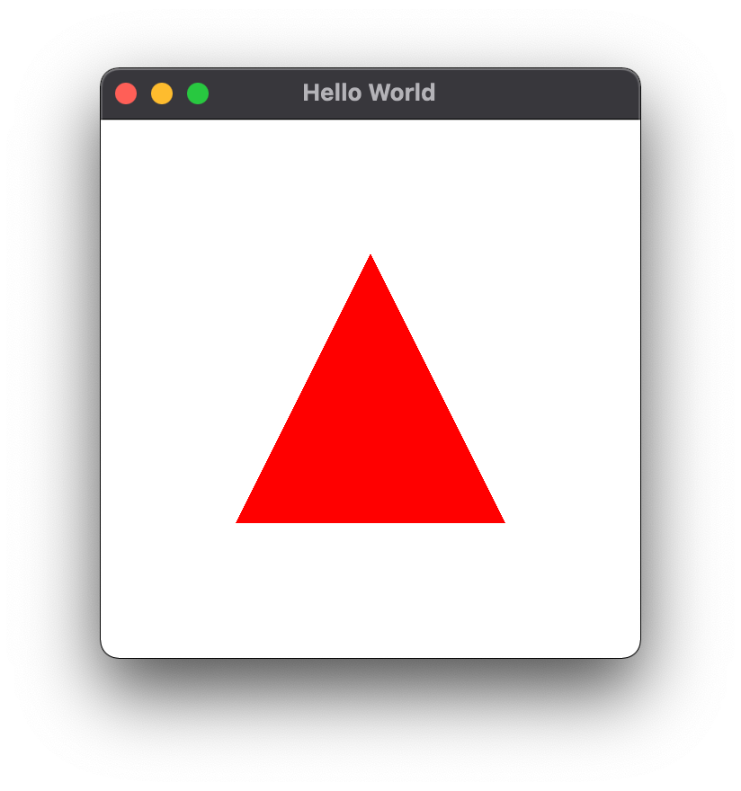

# lwjgl-sample

## third sample

create a triangle with vertex shader and fragment shader.

### build

```
mvn package
```

### run

```
java -cp target/lwjgl-sample-0.0.1-SNAPSHOT-jar-with-dependencies.jar com.github.tamurashingo.lwjgl.sample.HelloWorld2
```


run on mac

```
java -XstartOnFirstThread -cp target/lwjgl-sample-0.0.1-SNAPSHOT-jar-with-dependencies.jar com.github.tamurashingo.lwjgl.sample.HelloWorld2
```




## second sample

create a triangle with `GL_BEGIN` and `GL_END`.

### build

```
mvn package
```

### run

```
java -cp target/lwjgl-sample-0.0.1-SNAPSHOT-jar-with-dependencies.jar com.github.tamurashingo.lwjgl.sample.HelloWorld2
```


run on mac

```
java -XstartOnFirstThread -cp target/lwjgl-sample-0.0.1-SNAPSHOT-jar-with-dependencies.jar com.github.tamurashingo.lwjgl.sample.HelloWorld2
```


## first sample

create window.

### build

```
mvn package
```

### run

```
java -cp target/lwjgl-sample-0.0.1-SNAPSHOT-jar-with-dependencies.jar com.github.tamurashingo.lwjgl.sample.HelloWorld
```


run on mac

```
java -XstartOnFirstThread -cp target/lwjgl-sample-0.0.1-SNAPSHOT-jar-with-dependencies.jar com.github.tamurashingo.lwjgl.sample.HelloWorld
```

