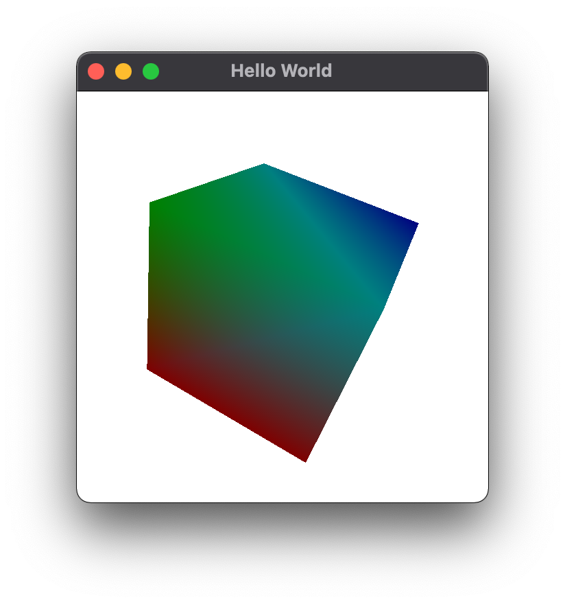
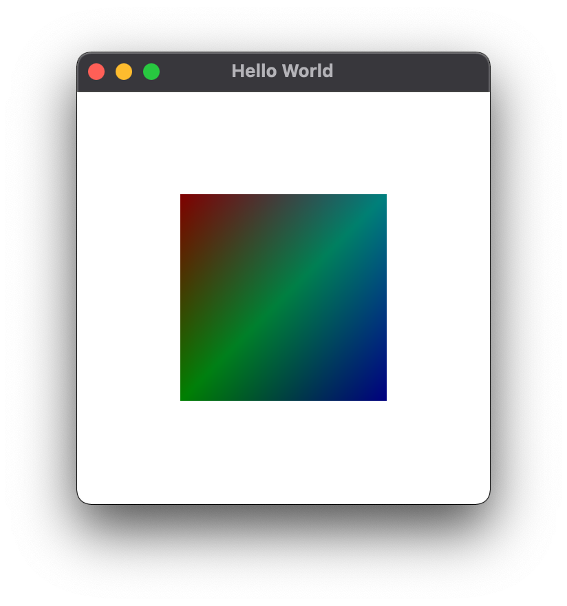

# lwjgl-sample

## 5th sample

rolling cube.

https://lwjglgamedev.gitbooks.io/3d-game-development-with-lwjgl/content/chapter06/chapter6.html

### build

### run

```
mvn package
```

### run

```
java -cp target/lwjgl-sample-0.0.1-SNAPSHOT-jar-with-dependencies.jar com.github.tamurashingo.lwjgl.sample.HelloWorld5
```


run on mac

```
java -XstartOnFirstThread -cp target/lwjgl-sample-0.0.1-SNAPSHOT-jar-with-dependencies.jar com.github.tamurashingo.lwjgl.sample.HelloWorld5
```




## 4th sample

create a mesh.

https://lwjglgamedev.gitbooks.io/3d-game-development-with-lwjgl/content/chapter05/chapter5.html

### build

### run

```
mvn package
```

### run

```
java -cp target/lwjgl-sample-0.0.1-SNAPSHOT-jar-with-dependencies.jar com.github.tamurashingo.lwjgl.sample.HelloWorld4
```


run on mac

```
java -XstartOnFirstThread -cp target/lwjgl-sample-0.0.1-SNAPSHOT-jar-with-dependencies.jar com.github.tamurashingo.lwjgl.sample.HelloWorld4
```




## third sample

create a triangle with vertex shader and fragment shader.

### build

```
mvn package
```

### run

```
java -cp target/lwjgl-sample-0.0.1-SNAPSHOT-jar-with-dependencies.jar com.github.tamurashingo.lwjgl.sample.HelloWorld3
```


run on mac

```
java -XstartOnFirstThread -cp target/lwjgl-sample-0.0.1-SNAPSHOT-jar-with-dependencies.jar com.github.tamurashingo.lwjgl.sample.HelloWorld3
```


## second sample

create a triangle with `GL_BEGIN` and `GL_END`.

### build

```
mvn package
```

### run

```
java -cp target/lwjgl-sample-0.0.1-SNAPSHOT-jar-with-dependencies.jar com.github.tamurashingo.lwjgl.sample.HelloWorld2
```


run on mac

```
java -XstartOnFirstThread -cp target/lwjgl-sample-0.0.1-SNAPSHOT-jar-with-dependencies.jar com.github.tamurashingo.lwjgl.sample.HelloWorld2
```


## first sample

create window.

### build

```
mvn package
```

### run

```
java -cp target/lwjgl-sample-0.0.1-SNAPSHOT-jar-with-dependencies.jar com.github.tamurashingo.lwjgl.sample.HelloWorld
```


run on mac

```
java -XstartOnFirstThread -cp target/lwjgl-sample-0.0.1-SNAPSHOT-jar-with-dependencies.jar com.github.tamurashingo.lwjgl.sample.HelloWorld
```

